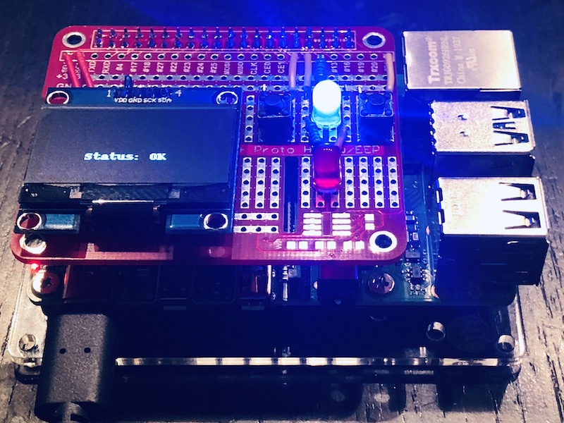

# Introduction

This is a very simple but extendable python framework to display different kind of information on a self-made Raspberry Pi HAT with a Display (type: sh1106, size: 128x64), two LEDs (a red one and a blue one), and with two buttons.

# List of used parts

* Breadboard: https://www.amazon.de/dp/B07MCX54ZD/ref=cm_sw_em_r_mt_dp_U_FCoGEbCCPKBDW
* LEDs, buttons, wires: https://www.amazon.de/dp/B01M7N4WB6/ref=cm_sw_em_r_mt_dp_U_6DoGEb17VB08T
* Display: https://www.amazon.de/dp/B078J78R45/ref=cm_sw_em_r_mt_dp_U_KEoGEb8J2Q6ZZ

* Raspberry Pi: https://www.amazon.de/dp/B07TC2BK1X/ref=cm_sw_em_r_mt_dp_U_SGoGEb8R24BM6
* ...

# Adding new views

TODO

# Installing

TODO